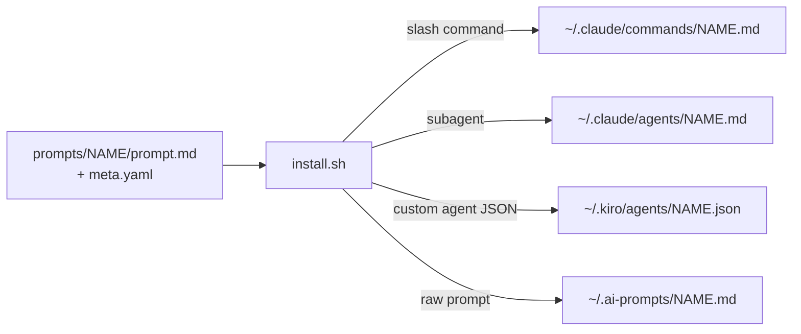

# flounderKSkills

Portable prompts and agents for AI coding tools. Each prompt is written **once** in
an interface-agnostic form, and `install.sh` wraps it into the native format for each
tool — so the same prompt works across Claude Code, Kiro CLI, and any tool that can
take a raw markdown prompt.



For the full picture — install pipeline, prompt logic, and the eval harness — see
[`docs/ARCHITECTURE.md`](docs/ARCHITECTURE.md).

## Layout

```
prompts/
  <name>/
    prompt.md      # the canonical prompt body — single source of truth
    meta.yaml      # flat key: value metadata (name, title, description, model)
install.sh         # wraps each prompt into per-interface formats and installs it
```

## Install

```sh
./install.sh                       # install every prompt into all interfaces, globally
./install.sh --target claude       # only Claude Code
./install.sh --only post-change-validation
./install.sh --scope project       # install into ./.claude, ./.kiro, ./.ai-prompts
./install.sh --dry-run             # show what would be written, write nothing
```

| Flag | Values | Default | Meaning |
|------|--------|---------|---------|
| `--target` | `all` `claude` `kiro` `generic` | `all` | which interface(s) to install into |
| `--scope`  | `global` `project` | `global` | `$HOME` vs. the current directory |
| `--only`   | a prompt directory name | (all) | install just one prompt |
| `--dry-run`| — | off | print the plan without writing |

Generating the Kiro JSON needs `jq` or `python3` on `PATH` (the Claude and generic
targets have no dependencies). Re-running is idempotent — it overwrites the installed
copies, so updating a machine is just `git pull && ./install.sh`.

## Where things land

| Target | Global path | What it becomes |
|--------|-------------|-----------------|
| `claude` | `~/.claude/commands/<name>.md` | slash command (`/<name>`) |
| `claude` | `~/.claude/agents/<name>.md` | subagent |
| `kiro` | `~/.kiro/agents/<name>.json` | custom agent |
| `generic` | `~/.ai-prompts/<name>.md` | raw portable prompt (copy/paste into anything) |

With `--scope project` the same files are written under `./.claude`, `./.kiro`, and
`./.ai-prompts` in the current directory instead of `$HOME`.

## Adding a prompt

1. Create `prompts/<name>/prompt.md` with the prompt body (interface-agnostic, imperative
   voice so it reads well as both a command and an agent system prompt).
2. Create `prompts/<name>/meta.yaml` with at least `name` and `description`.
3. Run `./install.sh --only <name>`.

## Prompts

- **post-change-validation** — a soft code-review pass to run after an LLM or human
  changes code. Reviews every changed file for robustness, correctness, completeness,
  duplication, testability, abstraction, correct placement (right layer/module/file),
  performance, documentation, dependency hygiene, steering compliance, hacks/band-aids,
  readability, and idiomatic design (patterns / anti-patterns / code smells); runs the
  test suite and linters
  and fixes what it can, flags the rest.
- **tech-debt-assessment** — a comprehensive, evidence-based audit of an *entire*
  codebase. Maps the code, runs analysis tooling (churn, complexity, duplication,
  dependency/vulnerability audits, coverage), and inventories debt across 15 dimensions,
  then produces a prioritized `TECH_DEBT_ASSESSMENT.md` with severity/effort scoring and
  a remediation roadmap. Reports only — it does not modify code.
