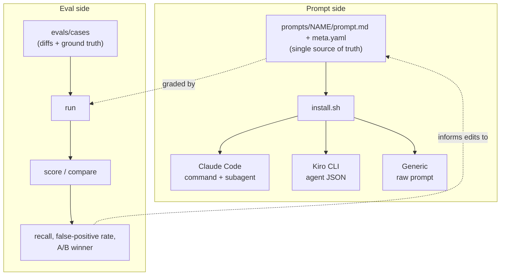
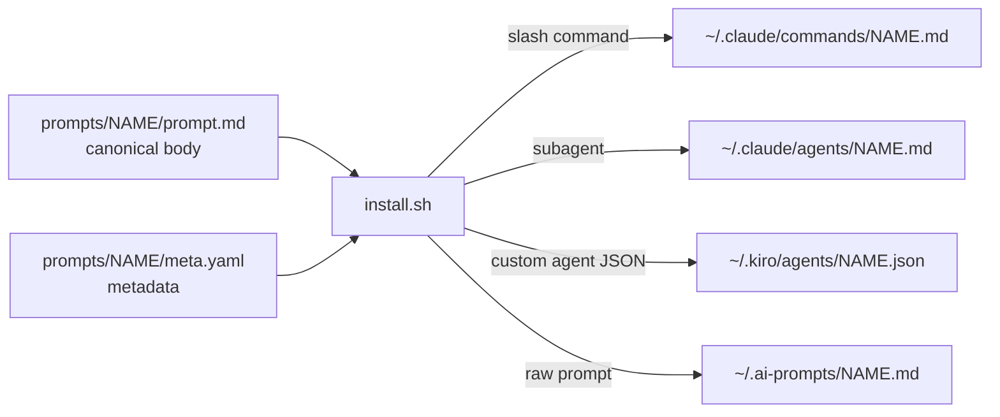
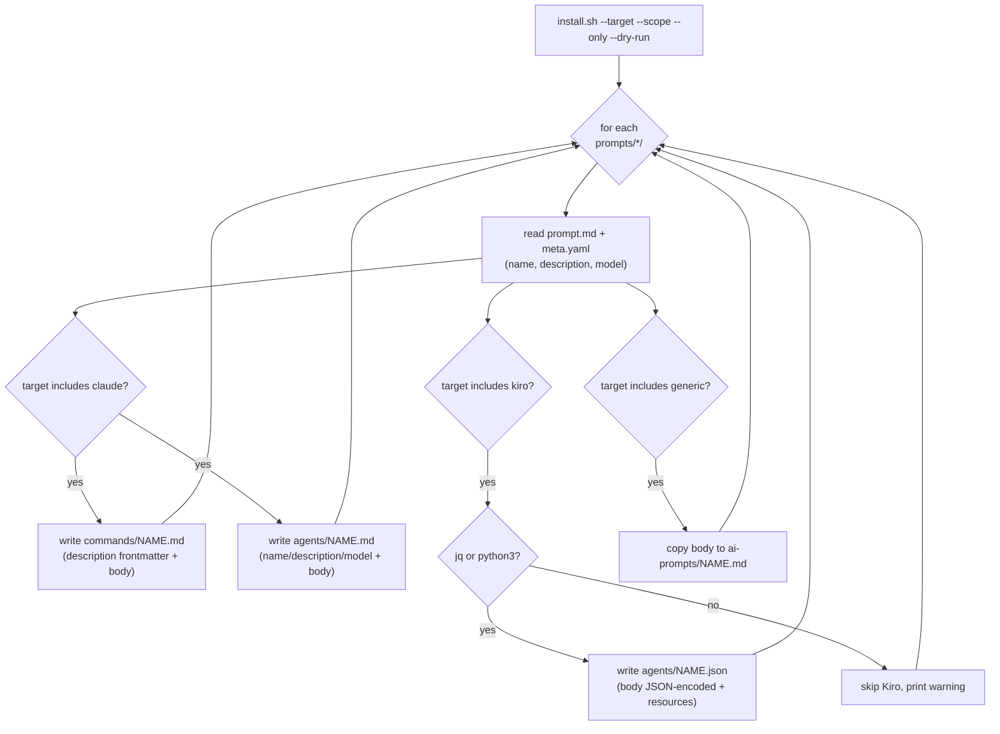
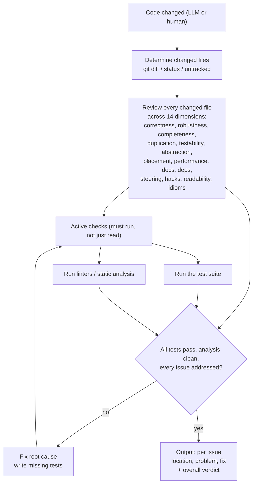
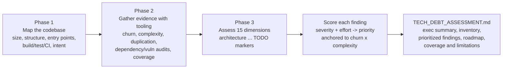
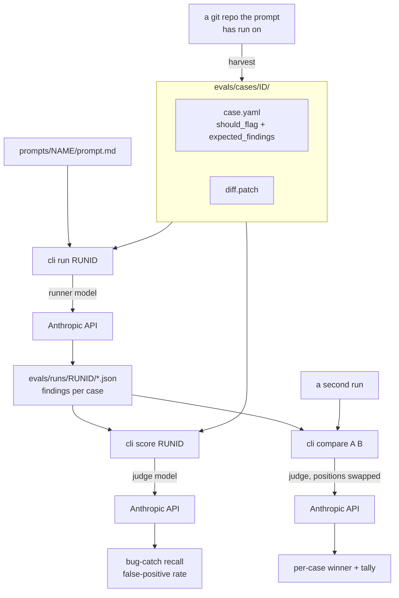
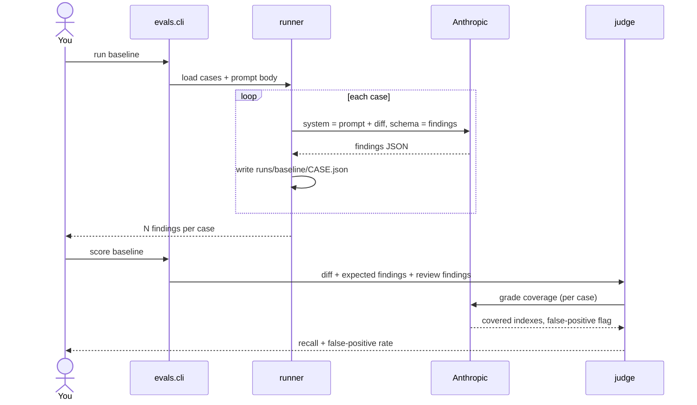
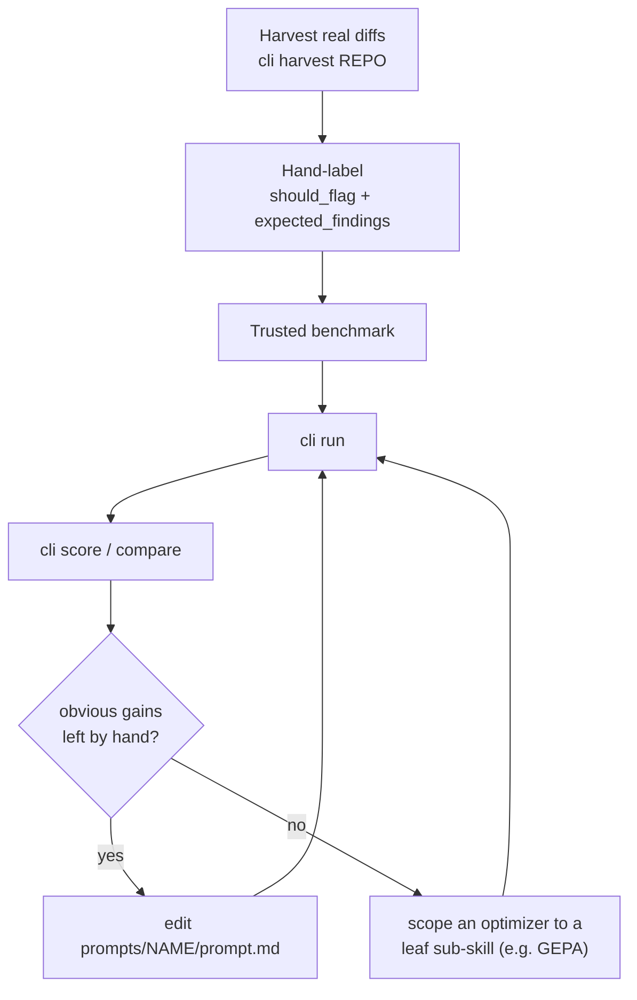

# Architecture

How this repo is put together: one canonical prompt per skill, an installer that adapts
it to each AI tool, and an eval harness that lets you tell whether a prompt change
actually helped. The diagrams below render on GitHub (Mermaid) and in most Markdown
viewers.

- [System overview](#system-overview)
- [Directory layout](#directory-layout)
- [Authoring model: one source, many interfaces](#authoring-model-one-source-many-interfaces)
- [The install pipeline](#the-install-pipeline)
- [Prompt logic](#prompt-logic)
  - [post-change-validation](#post-change-validation)
  - [tech-debt-assessment](#tech-debt-assessment)
- [Eval harness](#eval-harness)
- [The improvement workflow](#the-improvement-workflow)

---

## System overview

Two halves. The **prompt side** turns one source file into installable artifacts for
each tool. The **eval side** measures a prompt's quality so changes are driven by
evidence, not vibes.



The dotted edges are the point: the eval side reads the same `prompt.md` the install
side ships, and its metrics feed back into editing that file. Single source of truth
throughout.

---

## Directory layout

```
prompts/
  post-change-validation/
    prompt.md            # canonical, interface-agnostic prompt body
    meta.yaml            # name / title / description / model
  tech-debt-assessment/
    prompt.md
    meta.yaml
install.sh               # wraps each prompt into per-interface artifacts
docs/
  ARCHITECTURE.md        # this file
evals/
  cases/<id>/            # case.yaml (ground truth) + diff.patch (the change)
  harness/               # config, llm, dataset, run, score, compare, harvest
  cli.py                 # python -m evals.cli <command>
  runs/                  # run outputs (gitignored)
```

---

## Authoring model: one source, many interfaces

Every prompt is written once as `prompt.md` (imperative voice, so it reads correctly as
both an on-demand command and an agent system prompt) plus a flat `meta.yaml`.
`install.sh` is the only thing that knows each tool's wrapper format and install path.



Because the body is never duplicated by hand, updating a prompt everywhere is
`git pull && ./install.sh` — the installer overwrites the generated copies idempotently.

| Target | Global path | Becomes |
|--------|-------------|---------|
| `claude` | `~/.claude/commands/NAME.md` | slash command `/NAME` |
| `claude` | `~/.claude/agents/NAME.md` | subagent |
| `kiro` | `~/.kiro/agents/NAME.json` | custom agent |
| `generic` | `~/.ai-prompts/NAME.md` | raw portable prompt |

With `--scope project` the same files land under `./.claude`, `./.kiro`, and
`./.ai-prompts` in the current directory instead of `$HOME`.

---

## The install pipeline

`install.sh` discovers every `prompts/*/` directory, so new prompts install with no code
change. Only the Kiro target needs a tool (`jq` or `python3`) to JSON-encode the prompt
body safely; the Claude and generic targets are pure shell.



The Claude/generic writers stream the body verbatim (`cat`), so `$` and backticks in a
prompt can't be mangled by shell expansion. The Kiro writer uses `jq --rawfile` (or a
`python3 json.dumps` fallback) so the body is correctly escaped inside JSON.

---

## Prompt logic

### post-change-validation

A soft code-review to run **after** a change. It scopes to the changed files, reviews
them across 14 dimensions, then runs the project's tests and linters — and it isn't
"done" until those pass and every issue is addressed or precisely flagged.



### tech-debt-assessment

A whole-codebase audit that **reports only** — it never edits code. Three phases feed a
severity/effort scoring model, which feeds a prioritized report.



The two prompts are deliberate opposites: post-change-validation is **narrow + fix-in-place**;
tech-debt-assessment is **whole-repo + read-only report**.

---

## Eval harness

The harness answers one question: *did a prompt edit actually make the review better?*
It runs a prompt over labeled cases (single-shot — the model sees a diff and returns
JSON findings), then an LLM judge grades the output against ground truth.



A single `run` then `score`, as a sequence:



**Honest scope:** the runner is a single-shot *proxy*. The production prompt runs as a
tool-using agent (reads the repo, runs tests, edits files); the harness exercises only
the review *reasoning*, which is what prompt-tuning targets. A prompt that scores well
here still needs end-to-end testing in a real harness. See [`../evals/README.md`](../evals/README.md).

---

## The improvement workflow

The metric is the bottleneck, not the optimizer. Build a benchmark you trust, tune by
hand while there are obvious gains, and only reach for an automated optimizer (e.g.
DSPy/GEPA) once hand-tuning stalls — scoped to a narrow sub-skill where the ground truth
is clean.



The labeling step is where the value is: those labels are the ground truth every later
measurement trusts. Everything upstream (harvesting, running, judging) is mechanical;
the human judgment about what a good review *should* catch is what makes the numbers
mean something.
