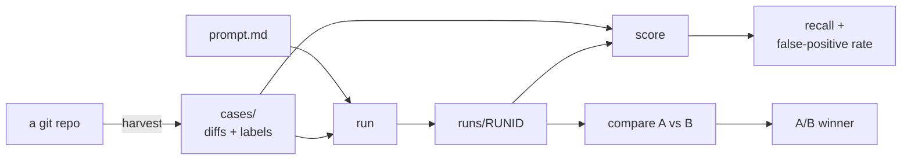

# Prompt evals

A small, honest benchmark for the prompts in this repo. The point isn't the optimizer —
it's having a metric you trust so "is this prompt actually better?" becomes answerable.
Build the benchmark first; tune by hand against it; only reach for an automated optimizer
(e.g. DSPy/GEPA) once you've exhausted obvious manual gains, and scope it to a narrow
sub-skill where the ground truth is clean.



See [`../docs/ARCHITECTURE.md`](../docs/ARCHITECTURE.md) for how this fits the rest of the repo.

## What this measures — and what it doesn't

The runner is a **single-shot proxy**. The production prompt runs as a tool-using agent
(reads the repo, runs tests/linters, edits files); here the model sees only a diff and
returns findings as JSON. That isolates the review *reasoning* — which is what
prompt-tuning targets — but does **not** exercise tool use, test-running, or fixing.
A prompt that scores well here still needs end-to-end testing in a real harness.

Two signals, both via an LLM judge:

- **Bug-catch recall** — of the known issues planted in each case, how many did the
  review catch? (reference-based; `score`)
- **False-positive rate** — on changes that are actually clean, did it cry wolf?
  (`score`)
- **Pairwise quality** — given two runs (e.g. two prompt versions), which review is
  better, judged twice with positions swapped to control for bias? (`compare`)

## Layout

```
evals/
  cases/<case-id>/
    case.yaml     # id, prompt, should_flag, description, expected_findings (ground truth)
    diff.patch    # the change to review
  harness/        # python package (config, llm, dataset, run, score, compare, harvest)
  cli.py          # entrypoint
  runs/           # run outputs (gitignored)
```

## Setup

```sh
pip install -r evals/requirements.txt
export ANTHROPIC_API_KEY=...        # or: ant auth login
```

Model defaults are `claude-opus-4-8` for both roles; override per run:

```sh
export EVAL_RUNNER_MODEL=claude-opus-4-8   # the prompt-under-test's model
export EVAL_JUDGE_MODEL=claude-opus-4-8     # the grader
```

## Use (run from the repo root)

```sh
# 1. Run the prompt over every case, saving findings under evals/runs/baseline/
python -m evals.cli run baseline

# 2. Score that run against ground truth
python -m evals.cli score baseline

# 3. Edit prompts/post-change-validation/prompt.md, run again, and A/B the two
python -m evals.cli run tweaked
python -m evals.cli compare baseline tweaked
```

`--only <case-id>` restricts any of these to a single case.

## Harvesting real cases

`harvest` grabs diffs from a repo you've been running the prompt on and drops them in as
new (unlabeled) cases — offline, git only:

```sh
python -m evals.cli harvest /path/to/repo                 # newest commit
python -m evals.cli harvest /path/to/repo --count 2       # last 2 commits
python -m evals.cli harvest /path/to/repo --working       # uncommitted changes
python -m evals.cli harvest /path/to/repo --rev <sha>     # a specific commit
```

It writes `case.yaml` (with `should_flag: null` and empty `expected_findings`) plus
`diff.patch`. **Then hand-label each one** — set `should_flag` and fill in
`expected_findings`. That human step is the whole value: the labels are the ground truth
the scorer trusts. A good source of real bug-introducing diffs is the commit a later fix
reverts (`git log` the fix, harvest the commit it blames).

## Seed cases

Three synthetic seeds ship so the harness runs out of the box: an off-by-one, an
unhandled-None, and one clean refactor (for the false-positive measure). Replace them
with harvested real diffs as you build the benchmark — synthetic seeds demonstrate the
format but aren't a substitute for real history.

## Tests

The offline-testable logic (JSON extraction, case loading, harvesting) has unit tests
that need neither the API nor the network:

```sh
python -m unittest discover -s evals/tests
```

The API-calling paths (`run`/`score`/`compare`) aren't unit-tested — verify those with a
live smoke run once `anthropic` and credentials are set up.
